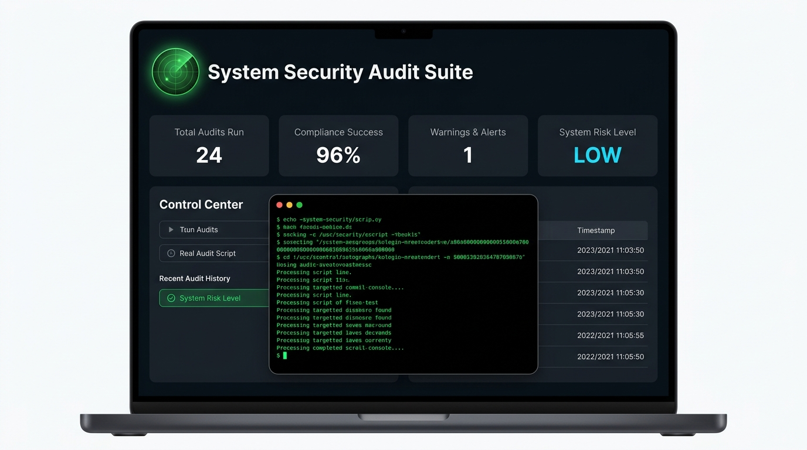

# System Security Audit and Compliance Toolkit (Windows)

A modernized, high-fidelity security auditing and regulatory compliance scanning suite for Windows environments. This application provides a central visual dashboard and console terminal interface to execute audit scripts, check compliance rulesets, run system hardening checks, and persist scan results in an SQLite database.

<p align="center">
    
</p>

---

## 🚀 Key Features

* **Host Audits**: Firewall status analysis, open port lists, user sessions audit, and active local user accounts mapping.
* **Compliance Checks**: Built-in script execution engine verifying requirements for standard regulatory regimes:
  - **ISO 27001** (Firewall config, RDP status, password complexity, audit logging rules)
  - **PCI-DSS** (SSL/TLS socket checks, unauthorized open port detection)
  - **HIPAA** (BitLocker disk encryption states, secure folder ACL rules)
* **Vulnerability Mitigation**:
  - **Patch Management** checks for missing Windows Updates.
  - **System Hardening** policies (Local password restrictions, Terminal Services parameters).
  - **Privilege Escalation** testing (Admin group checks, service registry ACL audits).
  - **Intrusion Detection** queries (Failed login Event ID 4625, process creations Event ID 4688).
* **High-Contrast Terminal UI**: Simulated terminal console featuring an output colorizer (marking `PASS` as green, `FAIL` as red, and `Warning` as yellow), a live scanning radar, and quick action headers to copy stdout or download reports.
* **Overview Metrics Dashboard**: Displays scans run counts, dynamically calculated compliance percentage rates, alerts/warnings trackers, and computed System Risk Levels.
* **SQLite Audit Trail Logs**: Log persistence mapping results chronologically, with sidebar reloading hooks, single-record deletion, and history database purges.

---

## 📂 Project Structure

* `src/`
  - `app.py`: Flask controller routing, DB log wrappers, and history REST endpoints.
  - `db.py`: SQLite connection schema management, log insertions, and history deletions.
  - `audit.py`, `compliance.py`, `security_tools.py`: Safe script execution managers with dynamic script path mapping and error-replacement text decoding.
* `scripts/`: Batch (`.bat`) and PowerShell (`.ps1`) scanner components.
* `frontend/`
  - `templates/index.html`: Responsive terminal console and logs dashboard markup.
  - `static/styles.css`: Visual dark terminal stylesheets, glowing accents, and radar animations.

---

## 🛠️ Setup & Execution

1. **Clone the repository**:
   ```bash
   git clone https://github.com/roy9495/security-audit-toolkit.git
   cd security-audit-toolkit
   ```

2. **Install dependencies**:
   ```bash
   py -m pip install -r requirements.txt
   ```

3. **Launch the web application**:
   ```bash
   cd src
   py app.py
   ```

4. **Access the console**:
   Open your browser and navigate to **[http://localhost:5000](http://localhost:5000)**
